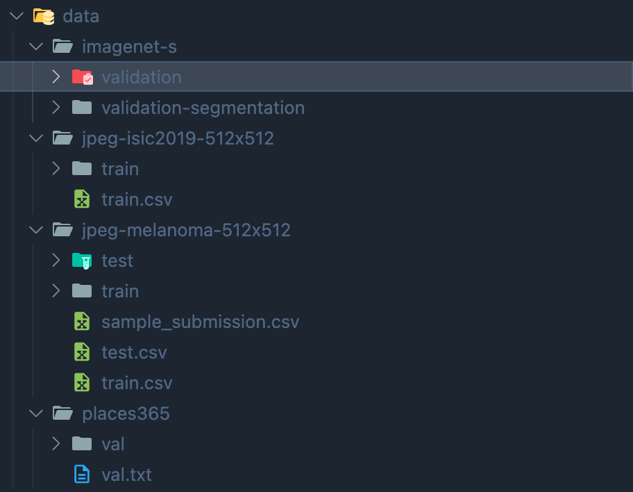
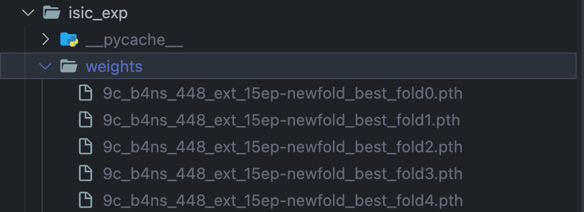
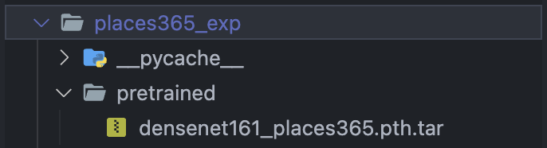

### Guided-AbsoluteGrad

This is the official implementation for Guided AbsoluteGrad. For more details, please refer to the paper [Guided AbsoluteGrad: Magnitude of GradientsMatters to Explanation’s Localization and Saliency](https://caiac.pubpub.org/pub/8rzaolsn/release/1?readingCollection=f2fe21d4).


### Quick Navigator

- `cv_exp/gradient/_guided_absolute_grad.py`: implementation of the Guided Absolute Grad;
- `cv_exp/eval/rcap_eval.py`: implementation of RCAP evaluation for saliency maps;


### Data Preparation

Please run `data_preparation.ipynb`.

If everything is correct, you should have the following structure in the data:



The `isic_exp/weights` folder should contain:



The `places365_exp/pretrained` folder should contain:




###  Quick Demo for each Case

Please run `imagenet_demo.ipynb`, `isic_demo.ipynb`,  `places365_demo.ipynb`.

Figures in the paper can be partially reproduced from the demo.


### Experiment Reproduction

To reproduce the experiment, run the command:

```bash
python cv_exp/exp.py -t sa -mk [ModelKey] -dk [DatasetKey] -m [Mode] -c [CaseName] [SettingKeys]
```

1. **<u>ModelKey</u>**: The explained model key. It should be the key defined in the `settings.py` of each case.

   For instance, `resnet50` is defined in the `get_model()` function of `cases/imagenet_exp/settings.py`.

2. **<u>DatasetKey</u>**: Similar to the ModelKey.  It should be the key defined in the `get_dataset()` function.

3. **<u>Mode</u>**: should be one of:

   1. `x`: run xai explanation to get all saliency map results;
   2. `e`: run RCAP evaluation;
   3. `a`: run AUC evaluation;
   4. `s`: run the `x` and the `e` at the same time;
   5. `sn`: run sanity check evaluation;

4. **<u>CaseName</u>**: the name of cases. It is just for naming the experiment result dir. It could be anything. 

5. **<u>SettingKeys</u>**: experiment keys defined in each case's `settings.py` file. If not provided, it will run for all experiments.


Example:

Run all experiments of the ImageNet case for XAI and the RCAP evaluation.

``` bash
python main.py -mk resnet50 -dk imagenet_seg -t sa -m s -c imagenet
```


Run only the `2.a_places365` experiments of the Places365 case.

```bash
python main.py -mk densenet161 -dk places365 -t sa -m x -c places365 2.a_places365 
```


### Experiment Evaluation & Result Observation

The RCAP should be calculated finally by the `batch_rcap(...)` function in the `cv_exp/eval/rcap_eval.py`

The `evaluation_result.ipynb` can run this function and plot all case results.

If all experiments are reproduced, one can verify the experiment results with the file ``evaluation_result_author_side.ipynb``


### Cite

```bib
@article{Huang2024Guided,
	author = {Huang, Jun and Liu, Yan},
	journal = {Proceedings of the Canadian Conference on Artificial Intelligence},
	year = {2024},
	month = {may 27},
	note = {https://caiac.pubpub.org/pub/8rzaolsn},
	publisher = {Canadian Artificial Intelligence Association (CAIAC)},
	title = {Guided {AbsoluteGrad} : Magnitude of {GradientsMatters} to {Explanation}\textquoteright{}s {Localization} and {Saliency}},
}
```
